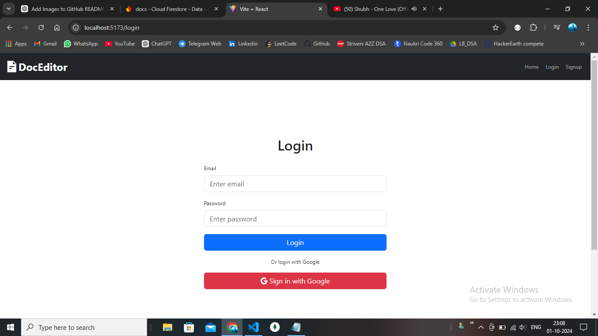

# Document Editor Application

## Description
A  document editor application built with React and Node.js, enabling real-time collaboration and document sharing. This application utilizes Quill.js for rich text editing, Firebase for authentication and Firestore for document management. Users can share documents with collaborators, and export documents to PDF format using html2pdf.

## Features
- User authentication with Firebase
- Real-time collaboration with Firestore
- Document sharing 
- Rich text editing using Quill.js
- PDF export functionality using html2pdf

## Technologies Used
- **Frontend**: React, Vite, Quill.js
- **Backend**: Node.js, Express
- **Database**: Firebase Firestore
- **Authentication**: Firebase Authentication
- **PDF Generation**: html2pdf

## Installation
To install and run this project locally:

1. Clone the repository:
   ```bash
   git clone https://github.com/vaishnaviparabkar90/DocEditor.git

2. Navigate to the backend folder and install dependencies:

cd my-backend
npm install dependencies like express 

3. Navigate to the frontend folder and install dependencies:

cd docs 
npm install  dependencies 

4. Start the backend server:

cd ../my-backend
node server.js

5. Start the frontend application:

cd docs 
npm run dev

## Screenshots




